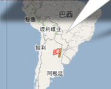

==============
让我们来打洞吧
==============

2011年04月3日

这里可以让我们打一个洞，一个穿过我们的小球的洞。来看看你脚下的出口在哪里吧！
操作方法：在地图上点一下，出现一个绿色的小旗，再点这个小旗，在弹出窗口中点击“Dig here！”。然后会出现一个小红旗，看看你的小红旗会出现在哪里？

我出现在这里：》

========================
Linux下常用的CLI软件[ZT]
========================

2011年03月30日

转贴自：http://lcan.info/2011/03/cli-software/

作者：Lanpice

作为Linuxer，必须具备一定的CLI操作能力。有时候用CLI会比用GUI会更方便快捷。

以下列出我所知道的一些常用CLI软件，仅供参考。

#. 中文终端。据我所知，目前主要有两个解决方案：zhcon和fbterm。两个我都用过，zhcon较长时间不更新了，问题比较多。不小心加错参数，甚至可能会导致死机。所以我推荐fbterm，这个还是很不错的，要使用的话，必须开启framebuffer。虽然某些方面也有些瑕疵，不过就目前而言，应该算是一个比较好用的中文终端了。有人可能会问：“中文输入怎么解决？”嘿嘿，这个倒不用担心。比较简陋的有fbterm_ucimf，另外还有基于ibus的ibus-fbterm可供选择。
#. 多窗口管理神器：tmux。功能和screen差不多，不过我感觉tmux更加强大、友好！可以横着切、竖着切窗口。让你充分利用你的屏幕！实乃远程管理、多任务控之必备神器啊！具体介绍请猛击这里围观。
#. 文件管理器：vim风格的可以选ranger，另外还有mc之类的。
#. 任务管理器：htop。这个可以理解为top的加强版。
#. 音乐播放器：moc。这个用来播放mp3,wma,flac等常见音频文件还是不错的，但是不支持ape和cue。如果这类文件比较多的，那就只能另寻他方了。cmus也不支持ape。
#. 视频播放器：mplayer。mplayer -vo fbdev2 “我要看的视频”
#. PDF/图片查看器：fbida。fbida里面包含了fbi, fbgs, ida, exiftran四个应用。其中fbi可以用来查看图片（FBI啊，名字就很牛X），fbgs可以用来查看PDF。前提嘛，估计各位看软件名就知道了，必须开启framebuffer。
#. 截图工具：fbgrab。不废话，看官方说明：fbgrab – takes screenshots using the framebuffer。在桌面环境下可以用scrot这个命令行软件截屏。
#. 文本编辑器：vim、emacs。这两个神器就不用介绍了吧？
#. IM软件：finch。这个可以看成是pidgin的CLI版。
#. IRC聊天：irssi。一个很强大的IRC客户端。
#. 邮件客户端：mutt。有关介绍请移步wiki。这个我基本不用。
#. 浏览器：w3m、lynx。w3m查看图片，需安装w3m-img。
#. 下载器：wget、axel、aria2c。其中aria2c支持HTTP(S)，FTP，BitTorrent，Metalink协议。
#. RSS阅读器：snownews。
#. Shell: zsh、bash。
#. 屏幕录像：recordmydesktop。此软件可用于录制GNOME、KDE等桌面。

==================
一个没有味道的年
==================
2011年 02月 10日 星期四 22:24:37 CST

都说“干净冬至邋遢年”，可是今年过年的天气却出忽意料的好，每天都有太阳，温度从年前的个位数直升到两位数。更难得的是我居然连续休息了七天，这真是一个奇迹啊！可是我觉得今年是最没有年味的一年。

首先是今年的烟火味不浓。除夕之夜没听到几声鞭炮，也没有嗅到浓浓的火药味。大年初一起床居然也没有看见满地的纸屑，只有一小坨纸屑在阳光下无力的趴着。年初一到年初四回想起来就没有听到焰火鞭炮声，就算是有，也不过如窗外的小鸟一掠而过。直到初四初五之交才骤然热闹了几分钟，不过几分钟而已，又复归平静。

其次是今年居然没有年饱的感觉，用李逵的话说就是“口中淡出鸟儿”。最近好多年，年年都会感觉到年饱，可是今年没有。一切如平常，没有多吃，也没有少吃。年前在沁园新村的楼上楼两家人吃了年夜饭，客人少，每个菜的量也少，刚好吃完，每人再来一碗面，吃得开心、舒心。看看对面三类店，居然爆满，那叫一个热闹。也许正是因为今年创新了，在面店吃的年夜饭，才使得年饱没有了基础。

最后是今年过节大部分的时间都宅在家里，少了一些人味。一些过年的保留节目今年都没有了，家的感觉真好，家里的阳光真的很温暖。

==================
You will forget it
==================
2011年 01月 29日 星期六 22:09:30 CST

好久没有使用 Opera 帐号了，不但忘了密码，甚至还忘了用户名。但是 Opera 的服务很帖心，只要记得注册的电子邮件就可以了。

Opera 的 Blog 标题可以写一个副标题，我原来想写“好记性不如烂笔头”。转念一想，要是写一句洋文多么时髦啊，可是我英文六级没过，只有靠搜索了，以下是我的搜索结果：

bing:Better memory than rotten written

google:Written as a good memory bad

iciba:Good memory as well written

yahoo:The retentiveness is inferior to the rotten writing skill

youdao:You will forget it

youdao 的翻译我觉得是最搞笑的，但是Cat的解释是这是一个意译，我觉得有点道理。所以我选择这个作为我的 Blog 的副标题，相当的有深意啊。

==================
今天看《非诚勿扰》
==================

2011-01-02 00:30:17
现在提这个题目很容易引起误解，所以要先说明我今天看是的江苏卫视的《非诚勿扰》，和以前一样，看这个节目很开心，也仅仅是开心。不知道从什么时候开始，我就不怎么看电视了，可是有这个节目后我只要记得起来就会看。W台也有个类似的节目叫《不见不散》，看来二马导演的标题还是挺招人爱的。W台的这个节目我就看了五分钟就看不下去了，所以好还是不好我没有发言权。今天看《非诚勿扰》时，我对J说看来一个节目好不好主要还是看主持人的水平。J问W台有好的节目吗？我说老陈的节目还是挺好的，我最喜欢的就是他的节目了，我一看见他就想笑。

